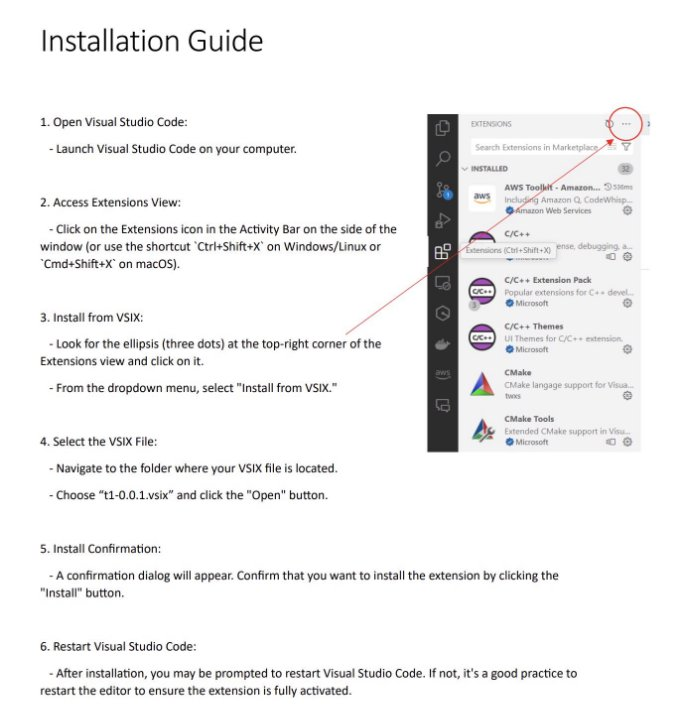
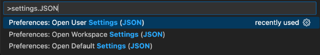
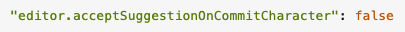
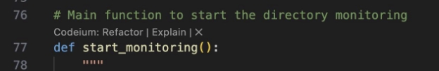
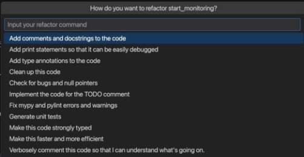
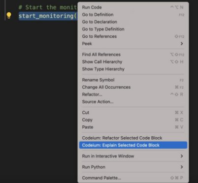
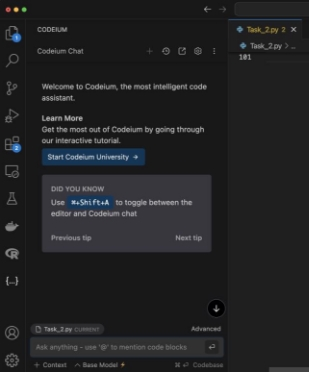

# Study Instructions: 

Welcome, and thank you for participating in this pilot study! Below, you will find important information and instructions to guide you through the study process. Please read carefully before beginning. 

## Purpose of the Study: 

This study aims to investigate the differences in how programming tasks are completed using Code Generation Tools (CGTs) versus traditional internet-based resources with respect to gender. We will examine how these methods influence your cognitive load and task performance while considering individual factors. 

## Overview of the Study: 

You will be asked to complete two programming tasks:

1. One task using a **CGT (Codeium)**. 
1. One task using **traditional internet resources** (e.g., search engines, forums, documentation). 

After each task, you will complete a survey that assesses your experience, including cognitive load and other factors. The tasks are designed to be completed in approximately 1 hour, however there is no time limit for the participant to complete the tasks. 

## Confidentiality and Consent:

- All data collected during this study will remain confidential.
- Participation is voluntary, and you may withdraw at any time without penalty.
- By proceeding, you consent to participate in this pilot study. 

## What You Need: 

1. A computer or laptop with internet access.
1. Access to the provided CGT (details will be shared below). 
1. Access to VS Code 

## General Guidelines: 

1. **Follow Task Instructions:** You will receive specific instructions for each task. Please adhere to these instructions and complete the tasks to the best of your ability.
2. **Use the Assigned Resources:** For one task, you must rely solely on the CGT, and for the other, you can use only traditional internet resources. Please do not mix the two.
2. **Work Independently:** Complete the tasks without external assistance. If you encounter any issues, please document them as part of your feedback.
2. **Complete the Surveys:** After each task, fill out the survey honestly and thoroughly. Your responses are critical to the success of this research.
- Task Survey **without CGT** usage: [https://ubc.ca1.qualtrics.com/jfe/form/SV_2csDn7uOoh1WiW2 ](https://ubc.ca1.qualtrics.com/jfe/form/SV_2csDn7uOoh1WiW2)
- Task Survey **with only CGT** usage: [https://ubc.ca1.qualtrics.com/jfe/form/SV_3lTKBofVAVOTlm6 ](https://ubc.ca1.qualtrics.com/jfe/form/SV_3lTKBofVAVOTlm6)
- Post Study Survey after completion of both tasks: [https://ubc.ca1.qualtrics.com/jfe/form/SV_032dOCjJex5L1UG](https://ubc.ca1.qualtrics.com/jfe/form/SV_032dOCjJex5L1UG)

## Technical Support: 

If you experience technical difficulties with the CGT or any aspect of the study, please let us know immediately so that we can assist. 

## Screen Recording: 

Participants will record their screen as an added precaution in case of tool failures. Screen recordings will be taken **separately for each task**. You do not need to record your completions of surveys, only the individual tasks.

Please ensure you have adequate storage (~ 1GB) if screen recording directly from the device: 

- Mac users: Can use built in recording if you have adequate storage space [https://support.apple.com/en-ca/102618 ](https://support.apple.com/en-ca/102618)
- Windows users: Please use a zoom meeting link to share and record your interactions (Note there is a 40min recording timer so multiple recordings may be needed for a single task). 

## How to install Code Monitoring: 

1. Install .vsix file from this repo
2. Follow the instructions below to setup the code monitoring tool.
**NOTE:** A JSON file with the CGT tool usage history will automatically be added to the file folder you are in, in the VS Code directory.

## Turning off VS Code built in IntelliSense (code complete):

1. Mac: CMD + Shift + P, Windows: CTRL + Shift + P 
1. In the search box enter “Settings.Json” and select the user settings file 

   

3. Add the following code to the file: 

   

4. Restart VS Code 

## How to Install Codeium and Use it: 

***Step 1: Visit the Codeium Website***

1. Go to the official Codeium website: **[https://codeium.com**.](https://codeium.com/)**
1. Select **Download.** 
1. Select **VS Code Extension** followed by **Quick Install**. 
1. Register with your email account (google account is easiest) by following the instructions. 
1. Verify your email to activate your account if you are not using a google account. 
1. Follow all remaining prompts from the download to complete download

***Step 2: Verify Installation*** 

1. Open a coding project in your IDE. 
1. Begin typing, and Codeium should display autocompletion suggestions.
1. If you experience issues, check the troubleshooting section on the Codeium website. 

***Step 3: Codeium Features*** 

1. **Autocomplete** – is based on user code, code comments, and docstrings, press tab to accept code suggestions.
1. **Quick Refactor** - Codeium will prompt you with a dropdown of selectable, pre - populated instructions that you can choose from. You can also write your own.
1. Quick Explain and Quick refactor is available above each method as seen below: 

2. When Quick factor is selected, the following options become available to the user. Use the ESC key to exit the refactor menu: 

3. **Quick Explain** – Highlight code and right click to open the task manager. Select “Codeium: Explain Selected Code Block” to open a chat in your IDE to explain the related code. In this chat box you can ask related questions to your project or tasks. 

Step 1:  

Step 2:  

## Next Steps: 

1. You will be told in what order to complete your tasks, and which to use the Codeium tool with and without (internet only).  
2. Before beginning, have the researcher confirm everything is set up accordingly before you begin.  
3. Begin with the first task you’ve been assigned. Detailed task instructions are in the Task folder of the rep. 
4. Complete the survey after finishing your first task. 
5. Proceed to the second task you’ve been assigned and complete the associated survey afterwards. 
6. Submit your results (task folder, zipped) through by uploading them to the Github repo under your participant number folder in participant trials.
7. Upload your recording to the following cloud folder [https://ubcca-my.sharepoint.com/:f:/g/personal/manaals_student_ubc_ca/EgJ92fKbuj5ItSM4o6qT-a4BV07sACwmwMLFzPuRdNqZrA?e=JdgPq8](OneDrive URL link) with your participant number, task number, and with or without CGT in the title, for example:
  a.  **P1\_T2\_Without.mp4** = Participant 1, Task 2, without CGT usage recording 

Thank you for your participation and valuable contribution to our research! If you have any questions, feel free to reach out before starting the study.
